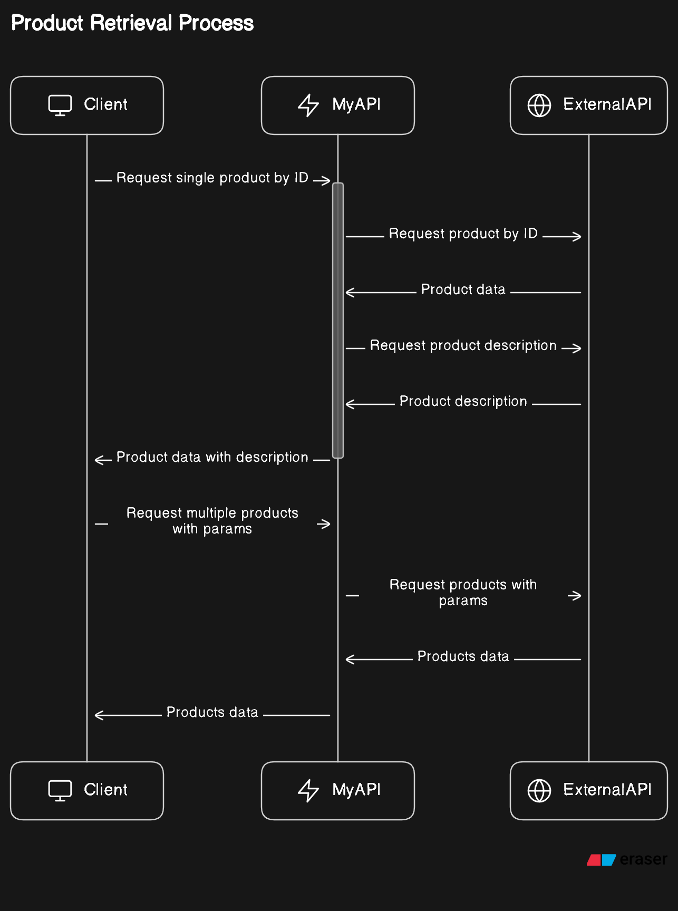

# MiddleEnd API Service

## Indice 

1. [Descripcion](#descripcion)
2. [Dependencias](#dependencias)
3. [Arranque del proyecto](#arranque-del-proyecto)
4. [Documentacion de la API](#documentacion-de-la-api)
    1. [Rutas](#rutas)
        1. [Autenticacion](#autenticacion)
        2. [Busqueda de productos general](#busqueda-de-productos-general-apiproductssearchsiteidq)
            1. [Path Parameters](#path-parameters)
            2. [Query Parameters](#query-parameters)
        3. [Busqueda de producto especifico](#busqueda-de-producto-especifico-apiproductid)
            1. [Path Parameters](#path-parameters-1)
5. [Diagrama de secuencia](#diagrama-de-secuencia)

6. [Creditos](#creditos)
7. [Licencia](#lincencia)


## Descripcion

Este proyecto sirve como API Proxy o servicio intermerdio entre un cliente y una API externa.

## Dependencias

Una vez clonado el repositrio, pararse en la carpeta raiz del proyecto y ejecutar el siguiente comando

```js
npm install
```

Las librerias utilizadas en este proyecto son:

    - nodemon
    - axios
    - express
    - swagger-ui-express
    - swagger-jsdoc

## Arranque del proyecto

Una vez instaladas las dependencias, se debe ejecutar el siguiente comando

```js
npm start
```

Si se ejecuto correctamente, debe aparacer un mensaje en la terminal como el siguiente


## Tests

Para correr los test del proyecto se debe ejecutar el siguiente comando:

```js
npm run test
```

## Documentacion de la API

Una vez ejecutado el proyecto, se puede visitar el siguiente enlace para ver las rutas documentadas y poder probarlas.

```
http://localhost:3000/api/docs
```

### Rutas

#### Autenticacion

Se debe pasar utilizar el token poder acceder a las rutas, de lo conrario, se devolvera un error de autenticacion

```e962f81a-4d42-4eb3-86cd-a25e7237c8dc```

O

Para recibir respuestas por defecto

```55a4639f-55e8-4e14-a6cc-b79977b20a4e```

#### Busqueda de productos general: *api/products/search/:siteId?q*

Esta ruta permite buscar productos basados en el valor de la cosnulta

#### Path Parameters

    - siteId: Es el valor del Id del sitio. Puede ser 'MLA', 'MLB', 'MLM'. Si se ingresa otro valor, o el mismo el nulo, la ruta devolvera un error.


#### Query Parameters

    - q: Valor del termino de busqueda
    - limit: Cantidad maxima de resultados devueltos por la busqueda. Valor por defecto 10.
    - offset: Valor del cual se empieza a mostrar los resultados. Valor por defecto 0.
    - sort: Puede tomar los valores `price_asc` o `price_desc`. Por defecto, el valor es `price_asc`.

#### Busqueda de producto especifico: *api/product/:id*

Esta ruta permite buscar un producto especifico basado segun el **id** provisto.

#### Path Parameters

    - id: Id del producto que se quiere buscar.

## Diagrama de secuencia 


## Creditos

Software Developer - Sebastian Levin(@SebaLevin)

## Lincencia
The MIT License (MIT)